# Discovering Interpretable Directions in the Semantic Latent Space of Diffusion Models

Rene Haas ´ 1 and Inbar Huberman-Spiegelglas2 and Rotem Mulayoff2 and Stella Graßhof1 and Sami S. Brandt1 and Tomer Michaeli2

1 Computer Science, IT University of Copenhagen, Denmark

2 Computer Science, Technion, Israel

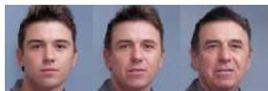  
Supervised

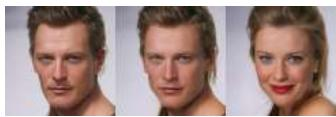  
Gender

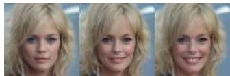  
Smile

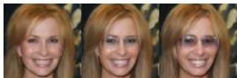  
Glasses

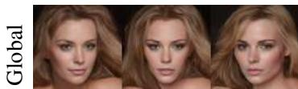  
Unsupervised   
Pose

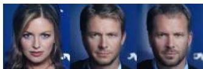  
Gender

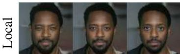  
Eyes opening

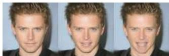  
Mouth opening   
Fig. 1: Our semantic image editing. We present new methods for finding interpretable disentangled semantic directions in the latent space of DDMs. Specifically, we propose a supervised (left) and two unsupervised (right) methods, where the latter finds either global directions based on a collection of images or local directions based on the analysis of a single sample.

Abstract— Denoising Diffusion Models (DDMs) have emerged as a strong competitor to Generative Adversarial Networks (GANs). However, despite their widespread use in image synthesis and editing applications, their latent space is still not as well understood. Recently, a semantic latent space for DDMs, coined $^ { 6 } h$ -space’, was shown to facilitate semantic image editing in a way reminiscent of GANs. The $h$ -space is comprised of the bottleneck activations in the DDM’s denoiser across all timesteps of the diffusion process. In this paper, we explore the properties of $h$ -space and propose several novel methods for finding meaningful semantic directions within it. We start by studying unsupervised methods for revealing interpretable semantic directions in pretrained DDMs. Specifically, we show that interpretable directions emerge as the principal components in the latent space. Additionally, we provide a novel method for discovering image-specific semantic directions by spectral analysis of the Jacobian of the denoiser w.r.t. the latent code. Next, we extend the analysis by finding directions in a supervised fashion in unconditional DDMs. We demonstrate how such directions can be found by annotating generated samples with a domain-specific attribute classifier. We further show how to semantically disentangle the found directions by simple linear projection. Our approaches are applicable without requiring any architectural modifications, text-based guidance, CLIP-based optimization, or model fine-tuning.

# I. INTRODUCTION

Denoising Diffusion Models (DDMs) [38] have emerged as a strong alternative to Generative Adversarial Networks

(GANs) [5]. Today, they outperform GANs in unconditional image synthesis [3], a task in which GANs have been dominating in recent years. Besides synthesizing high-quality and diverse images, DDMs can also be used for conditional synthesis tasks by guiding them on various user inputs [10], such as a user-provided reference image [13], [17] or a text-prompt by utilizing Contrastive Language-Image Pretraining (CLIP) [23]. Conditional DDMs have seen great success, particularly in the context of text-based synthesis. Specifically, recent large-scale text-conditional systems like DALL-E [27], [26], Stable Diffusion [28] and Imagen [34] have sparked a surge of research related to text-driven image editing using DDMs [19], [18], [4], [32], [11], [12], [8], [42], [2]. While there has been extensive research on finding disentangled editing directions in the latent space of unconditional GANs [1], [35], [7], [6], [37], [40], [25], comparatively little work has been done on this topic for unconditional DDMs. Despite their popularity, it is still not well understood how to leverage the latent space of DDMs for semantic image editing in the unconditional setting, i.e., in the absence of CLIP-guidance and without conditioning on a reference image.

In this paper, we propose novel editing techniques by utilizing the semantic latent space of DDMs which was recently proposed by Kwon et al. [14]. The semantic latent

space, coined $^ { \bullet } h \cdot$ -space’, is the space of the deepest feature maps of the denoiser. Our research explores supervised and unsupervised methods for finding semantically interpretable editing directions in unconditional DDMs.

We start by proposing two unsupervised methods. In Sec. IV, we demonstrate that interpretable editing directions, like pose, gender, and age emerge as the principal components in the semantic latent space. Additionally, we propose a novel unsupervised method for discovering image-specific semantic directions resulting in highly localized edits like opening/closing of the mouth and eyes that can also be applied to other samples. We illustrate a selection of these unsupervised editing directions in Fig. 1 (right pane). Next, in Sec. V, we utilize the linear properties of the semantic latent space and propose a simple supervised method for finding interpretable editing directions, like age and gender or the appearance of glasses or a smile. We illustrate examples of these edits in Fig. 1 (left pane). We demonstrate our approach by annotating samples generated by an unconditional DDM using a pretrained attribute classifier. We further propose a simple method for disentangling directions that affect multiple attributes. Our approaches allow for intuitive and semantically disentangled image editing and can be applied to the latent space of DDMs without requiring any CLIP guidance, fine-tuning, optimization or any adaptations to the architecture of existing DDMs.

To summarize the contributions of this paper are the following:

• We propose an unsupervised method to uncover semantically meaningful directions in the $h$ -space by PCA.   
• Our method successfully identifies image-specific semantically meaningful directions corresponding to highly localized changes.   
• We demonstrate a supervised approach to obtain latent directions corresponding to well-defined labels.   
• We propose a conditional manipulation in $h$ -space to disentangle semantic directions.   
• The code for this project is available at https:// github.com/renhaa/semantic-diffusion.

# II. RELATED WORK

# A. The latent space of diffusion models

GANs have a well-defined latent space suitable for semantic editing. To which extent DDMs possess such a convenient latent space is still a topic of ongoing research. Here we start by reviewing two approaches for defining a latent space in DDMs that facilitate semantic editing.

Using DDIM sampling proposed by Song et al. [39], the generative process is a deterministic mapping from a Gaussian noise vector $\mathbf { x } _ { T } \sim \mathcal { N } ( \mathbf { 0 } , \mathbf { I } )$ to a sampled image $\mathbf { x } _ { \mathrm { 0 } }$ . In the DDIM framework, the fully noised image $\mathbf { x } _ { T }$ , can be regarded as the latent representation. DDIM has the property that fixing $\mathbf { x } _ { T }$ leads to images with similar highlevel features irrespective of the length of the generative process. Furthermore, interpolating between two latent codes $\mathbf { \dot { x } } _ { T } ^ { ( 1 ) }$ and x(2)T $\mathbf { x } _ { T } ^ { ( 2 ) }$ leads to images that vary smoothly between the two corresponding endpoint images, $\mathbf { x } _ { 0 } ^ { ( 1 ) }$ a nd x(20 $\mathbf { \Delta x } _ { 0 } ^ { ( 2 ) }$

Kwon et al. [14] propose $h$ -space for DDMs, the set of bottleneck feature maps of the U-Net [29] across all timesteps, $\{ \mathbf { h } _ { T } , \dotsc , \mathbf { h } _ { 1 } \}$ as the latent space. Each bottleneck feature map $\mathbf { h } _ { t }$ has a lower spatial dimension but more channels than the output image. They show that semantics can be edited by adding offsets $\Delta \mathbf { h } _ { t }$ to the feature maps during the generative process. To find editing directions, they use an optimization procedure involving CLIP, where the semantics to be edited are described by text prompts. The $h$ - space has the following properties: (i) a direction $\Delta \mathbf { h } _ { t }$ has the same semantic effect on different samples; (ii) the magnitude of $\Delta \mathbf { h } _ { t }$ controls the strength of the edit; (iii) $h$ -space is additive in the sense that applying a linear combination of different directions where each $\Delta \mathbf { h } _ { t }$ corresponds to a distinct attribute, results in a generated image where all attributes have been changed.

# B. Semantic image editing in generative models

Semantic editing has been widely explored in GANs [35], [7], [6], [37], [40], [21], [25], [41], [46]. Shen et al. [35] used a binary classifier to annotate generated samples and trained a SVM to separate classes like pose, age, and gender. The corresponding linear directions in latent space were then defined as the normal vectors of the separating hyper-planes. Hark¨ onen¨ et al. [7] found interpretable control directions in pretrained GANs by applying principal components of latent codes to appropriate layers of the generator. Another line of work [6], [37], [40], [48] uses various factorization techniques to define meaningful directions in the latent space of GANs.

Semantic image editing has also been shown in DDMs but many existing methods make adaptations to the architecture, employ text-based optimization or model fine-tuning. In DiffusionAE [22], a DDM was trained in conjunction with an image encoder. This enabled attribute manipulation on real images, including modifications of gender, age, and smile, but requires modifying the DDM architecture. Another line of work includes DiffusionCLIP [12], Imagic [11], and UniTune [43], combined CLIP-based text guidance with model fine-tuning. Unlike these methods, our approaches do not require CLIP-based text-guidance nor model fine-tuning and can be applied to existing DDMs without retraining or adapting the architecture.

We acknowledge as concurrent work the unsupervised method proposed by Park et al. [20]. They perform spectral analysis on the Jacobian of a mapping from pixel space to a reduced $h$ -space consisting of the sum-pooled feature map of the bottleneck representation. In comparison, our proposed method is able to operate on the full bottleneck representation using power iteration to circumvent the intractable computational cost of calculating the Jacobian explicitly. We further propose to allow for additional region-specific control by calculating the Jacobian with respect to a region of interest, allowing for fine-grained and highly localized semantic editing.

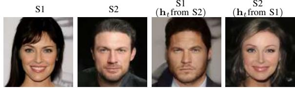  
(a) Effect of swapping the bottleneck activation.

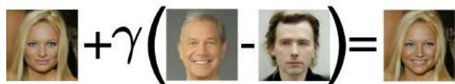  
(b) Vector arithmetic in the semantic latent space.   
Fig. 2: Illustration of properties of the $h$ -space. (a) Swapping $\mathbf { h } _ { T : 1 }$ between two samples, S1 and S2, swaps the semantic content without affecting background. (b) Adding the difference in bottleneck activation $\mathbf { h } _ { T : 1 }$ between a smiling and non-smiling person results in a smile in a new sample. The result are shown with strength parameter $\gamma = 1 / 5$ .

# III. THE SEMANTIC LATENT SPACE OF DDMS

Diffusion models are defined in terms of a forward diffusion process that adds increasing amounts of white Gaussian noise to a clean image $\mathbf { x } _ { \mathrm { 0 } }$ in $T$ steps, and a learned reverse process that gradually removes the noise. During the forward process each noisy image $\mathbf { x } _ { t }$ is generated as

$$
\mathbf {x} _ {t} = \sqrt {\alpha_ {t}} \mathbf {x} _ {0} + \sqrt {1 - \alpha_ {t}} \mathbf {n}, \tag {1}
$$

where $\mathbf { n } \sim \mathcal { N } ( \mathbf { 0 } , \mathbf { I } )$ and the noise schedule is defined by $\left\{ \alpha _ { t } \right\}$ . In [39], generating an image from the model is done by first sampling Gaussian noise $\mathbf { x } _ { T } \sim \mathcal { N } ( \mathbf { 0 } , \mathbf { I } )$ , which is then denoised following the approximate reverse diffusion process

$$
\mathbf {x} _ {t - 1} = \sqrt {\alpha_ {t - 1}} \mathbf {P} _ {t} \left(\boldsymbol {\epsilon} _ {t} ^ {\theta} \left(\mathbf {x} _ {t}\right)\right) + \mathbf {D} _ {t} \left(\boldsymbol {\epsilon} _ {t} ^ {\theta} \left(\mathbf {x} _ {t}\right)\right) + \sigma_ {t} \mathbf {z} _ {t}, \tag {2}
$$

where $\mathbf { z } _ { t } \sim \mathcal { N } ( \mathbf { 0 } , \mathbf { I } )$ . Here $\epsilon _ { t } ^ { \theta }$ is a neural network (usually a U-Net [29]), which is trained to predict $\mathbf { n }$ from $\mathbf { x } _ { t }$ , and the terms

$$
\mathbf {P} _ {t} \left(\boldsymbol {\epsilon} _ {t} ^ {\theta} \left(\mathbf {x} _ {t}\right)\right) = \frac {\mathbf {x} _ {t} - \sqrt {1 - \alpha_ {t}} \boldsymbol {\epsilon} _ {t} ^ {\theta} \left(\mathbf {x} _ {t}\right)}{\sqrt {\alpha_ {t}}} \tag {3}
$$

and

$$
\mathbf {D} _ {t} \left(\boldsymbol {\epsilon} _ {t} ^ {\theta} \left(\mathbf {x} _ {t}\right)\right) = \sqrt {1 - \alpha_ {t - 1} - \sigma_ {t} ^ {2}} \boldsymbol {\epsilon} _ {t} ^ {\theta} \left(\mathbf {x} _ {t}\right) \tag {4}
$$

are the predicted $\mathbf { x } _ { \mathrm { 0 } }$ and the direction pointing to $\mathbf { x } _ { t }$ at timestep $t$ , respectively. The variance $\sigma _ { t }$ is taken to be

$$
\sigma_ {t} = \eta_ {t} \sqrt {(1 - \alpha_ {t - 1}) / (1 - \alpha_ {t})} \sqrt {1 - \alpha_ {t} / \alpha_ {t - 1}}. \quad (5)
$$

The special case where $\eta _ { t } = 0$ for all $t$ is called DDIM [39]. In this setting the noise variance is $\sigma _ { t } ~ = ~ 0$ , so that the sampling process is deterministic and fully reversible [9], [3] (i.e., $\mathbf { x } _ { T }$ can be uniquely obtained from $\mathbf { x } _ { \mathrm { 0 } }$ ). The case where $\eta _ { t } = 1$ corresponds to the stochastic DDPM scheme [9].

Following Kwon et al. [14], we study the semantic latent space of DDMs corresponding to the activation of the bottleneck feature maps of the U-Net. We denote the concatenation of the bottleneck activation across all timesteps as $\mathbf { h } _ { T : 1 }$

see supplementary material (SM) Sec. A for illustration and additional details. In [14] image editing was performed via an asymetric reverse process (Asyrp), where $\Delta \mathbf { h } _ { t }$ is only injected into $\mathbf { P } _ { t }$ of (2) and not to $\mathbf { D } _ { t }$ . Empirically, we find that Asyrp amplifies the effect of the edits but semantic editing is also possible without using Asyrp. In this paper, we inject $\Delta \mathbf { h } _ { t }$ into both terms of (2). This has the benefit of only requiring a single forward pass of the U-Net at each step of the sampling process, as opposed to the two forward passes needed in Asyrp (one for $\mathbf { P } _ { t }$ with injection and one for $\mathbf { D } _ { t }$ without the injection). In SM Sec. B we provide a comparison of the effect of editing with and without using Asyrp.

The bottleneck activation $\mathbf { h } _ { t }$ is determined directly from $\mathbf { x } _ { t }$ in each step of the generative process. It is worth noting that although most of the high-level semantic content of the generated image is determined by $\mathbf { h } _ { T : 1 }$ , it is not a complete latent representation in the sense that it does not completely specify the generated image. We illustrate this point in Fig. 2a where we swap $\mathbf { h } _ { T : 1 }$ between two samples while keeping $\left\{ \mathbf { x } _ { T } , \mathbf { z } _ { T : 1 } \right\}$ fixed. We observe that swapping $\mathbf { h } _ { T : 1 }$ results in a swap of the high-level semantics, like the gender, but not the background.

A key property of $h$ -space is that it obeys vector arithmetic properties which have previously been demonstrated for GANs by Radford et al. [24]. Specifically, image editing can be done in $h$ -space as follows. Suppose we have found a direction $\mathbf { v } _ { T : 1 }$ associated with some semantic content that we wish to apply to a sample with latent code $\mathbf { h } _ { T : 1 }$ . Then $\mathbf { h } _ { T : 1 } ^ { ( \mathrm { e d i t } ) } = \mathbf { h } _ { T : 1 } + \gamma \mathbf { v } _ { T : 1 }$ hT :1 is the latent code of the edited image, where $\gamma$ controls the strength of the edit. In Fig. 2b we illustrate the vector arithmetic property of $h$ -space by adding a difference vector which has the semantic effect of adding a smile.

# IV. UNSUPERVISED SEMANTIC DIRECTIONS

# A. Principal component analysis

Our first goal is to uncover interesting semantic directions in an unsupervised fashion. To this end, we first explore the use of principal component analysis (PCA) in $h$ -space. In the context of GANs [7], it was shown that the principal components of a collection of randomly sampled latent codes result in semantically interpretable editing directions. Here we demonstrate that the same is true for DDMs if the PCA is performed in the semantic $h$ -space. Specifically, we consider PCA where we generate $n$ random samples and save the bottleneck activation $\mathbf { h } _ { t } ^ { ( i ) }$ for each sample $i$ at all timesteps. Then, for each timestep $t$ we vectorize {h(i)t }ni=1 $\{ \mathbf { h } _ { t } ^ { ( i ) } \} _ { i = 1 } ^ { n }$ and calculate the principal components. We use Incremental PCA [30] in order to calculate PCA on more samples than would otherwise fit in memory. We define the editing direction $\mathbf { v } _ { j }$ as a concatenation of the $j ^ { ; }$ ’th principal component from all timesteps. To demonstrate our method, we use Diffusers [44] and a DDPM1 trained on the CelebA

  
Fig. 3: PCA in the semantic latent space. PCA in $h$ -space provides a way for discovering disentangled and semantically meaningful directions. Here we show a selection of semantic edits corresponding to pose, smile, gender and age.

[16] data set. Unless stated otherwise, all results use $\eta _ { t } = 1$ during the synthesis process.

It can be seen that many principal directions have clear semantic interpretations, Fig. 3 demonstrates the effect of several of these directions, including directions corresponding to gender, pose, age, and smile. Fig. 4a and 4b compares the effect of applying the two dominant principal components to random directions. For a fair comparison, we set the norm of $\Delta \mathbf { h } _ { t }$ for the random directions to match that of the principal components. While interpolating along principal directions leads to semantically interpretable edits, shifting along random directions only induces minor changes to the image at small scales and rapid degradation of the image at larger scales.

# B. Discovering image-specific semantic edits

The directions found with PCA are computed based on many samples and tend to find global changes such as pose and gender, while more local changes like the closing of the eyes are absent. The smile direction is the only direction we observed where the semantic changes are localized to a specific region like the mouth. In the following, we present a method to find directions that are specific to a single image and region of interest.

To find directions specific to a single image we wish to find a set of orthogonal directions in $h$ -space that induce the largest change in the prediction of the clean image $\mathbf { P } _ { t } ( \epsilon _ { t } ^ { \theta } ( \mathbf { x } _ { t } ) )$ at every timestep. This is equivalent to finding the directions that change $\epsilon _ { t } ^ { \theta } ( \mathbf { x } _ { t } )$ the most (see SM Sec. C). For small perturbations, these directions are the top righthand singular vectors of the Jacobian of $\epsilon _ { t } ^ { \theta }$ with respect to $\mathbf { h } _ { t }$ . Due to the skip-connections in the U-Net, the output of the network depends on both $\mathbf { x } _ { t }$ and $\mathbf { h } _ { t }$ . Yet, here we only consider the dependency on the latent variable $\mathbf { h } _ { t }$ . In

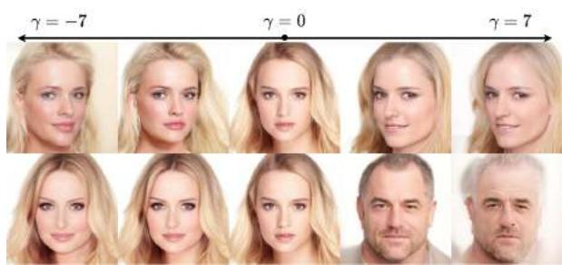

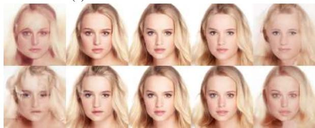  
(a) Two dominant PCA directions   
(b) Random directions   
Fig. 4: PCA v. random directions While directions found with PCA have a clear semantic meaning, like pose and gender, interpolating along random directions results in only minor changes to the image when using the same scale. Increasing the scale results in a degradation of the image.

the following, we denote the Jacobian of $\epsilon _ { t } ^ { \theta }$ by $\mathbf { J } _ { t }$ and its singular value decomposition (SVD) as

$$
\mathbf {J} _ {t} \triangleq \frac {\partial \epsilon_ {t} ^ {\theta} \left(\mathbf {x} _ {t} , \mathbf {h} _ {t}\right)}{\partial \mathbf {h} _ {t}} = \mathbf {U} _ {t} \boldsymbol {\Sigma} _ {t} \mathbf {V} _ {t} ^ {\mathrm {T}}. \tag {6}
$$

The right singular vectors corresponding to the largest singular values, (the columns of $\mathbf { V } _ { t }$ ) are the set of orthogonal vectors in $h$ -space which perturb the predicted image the most. Note that for each timestep $t$ , we have a different set of directions. In practice, we find that semantically interesting effects are obtained by applying directions found at timestep t across all timesteps. Thus, computing $k$ directions per timestep provide us $k T$ potential edits in each of the $T$ timesteps. In SM Sec. D, we illustrate the qualitative difference between directions computed at different timesteps.

In practice, calculating $\mathbf { J } _ { t }$ directly is computationally expensive. Instead, we find the dominant singular vectors by power-iteration over the matrix $\mathbf { J } _ { t } ^ { \mathrm { T } } \mathbf { J } _ { t }$ , whose eigenvectors are precisely the right singular vectors of $\mathbf { J } _ { t }$ . Each iteration requires multiplication by $\mathbf { J } _ { t } ^ { \mathrm { T } } \mathbf { J } _ { t }$ , which can be computed without ever storing the Jacobian matrix in memory. Specifically, for any vector v, the product $\mathbf { J } _ { t } ^ { \mathrm { T } } \mathbf { J } _ { t } \mathbf { v }$ can be computed as

$$
\mathbf {J} _ {t} ^ {\mathrm {T}} \mathbf {J} _ {t} \mathbf {v} = \frac {\partial}{\partial \mathbf {h} _ {t}} \left\langle \boldsymbol {\epsilon} _ {t} ^ {\theta} \left(\mathbf {x} _ {t}, \mathbf {h} _ {t}\right), \mathbf {J} _ {t} \mathbf {v} \right\rangle \tag {7}
$$

with

$$
\mathbf {J} _ {t} \mathbf {v} = \left. \frac {\partial}{\partial a} \boldsymbol {\epsilon} _ {t} ^ {\theta} \left(\mathbf {x} _ {t}, \mathbf {h} _ {t} + a \mathbf {v}\right) \right| _ {a = 0}. \tag {8}
$$

Our algorithm is summarized in Alg. 1 and uses (7) to calculate the singular vectors of the Jacobian of an

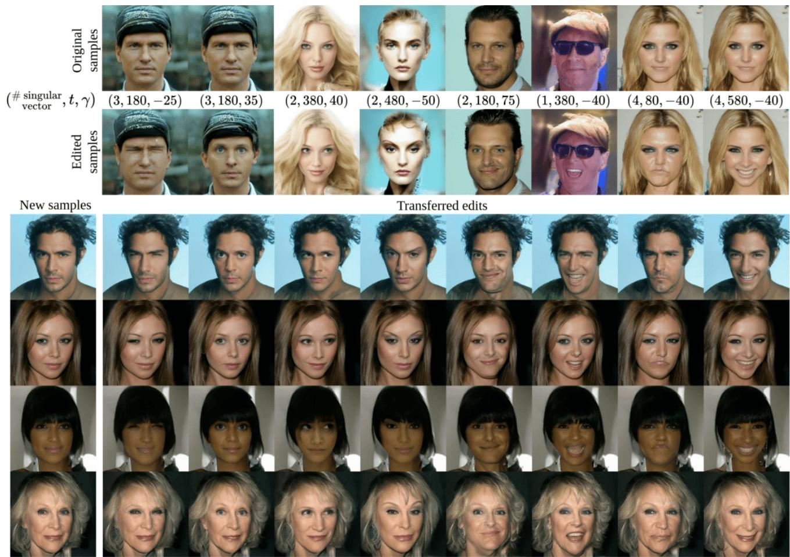  
Fig. 5: Unsupervised image-specific edits. Spectral analysis of the Jacobian of $\epsilon _ { t } ^ { \theta }$ yields directions corresponding to localized changes in the generated image, e.g. eyes opening/closing and raising of the eyebrows. Although this method is image-specific, directions found for one sample can be transferred to others, where they result in semantically similar edits.

# Algorithm 1 Jacobian subspace iteration

Input: f $: \mathbb { R } ^ { d _ { \mathrm { i n } } }  \mathbb { R } ^ { d _ { \mathrm { o u t } } }$ , $\mathbf { h } \in \mathbb { R } ^ { d _ { \mathrm { i n } } }$ and $\mathbf { V } \in \mathbb { R } ^ { d _ { \mathrm { i n } } \times k }$

Output: $( \mathbf { U } , \pmb { \Sigma } , \mathbf { V } ^ { \mathrm { T } } ) - k$ largest singular values and singular vectors of the Jacobian ${ \partial \mathbf { f } } / { \partial \mathbf { h } }$

$$
\mathbf {y} \leftarrow \mathbf {f} (\mathbf {h})
$$

if $\mathbf { V }$ is empty then

$\mathbf { V } \gets$ i.i.d. standard Gaussian samples

end if

$\mathbf { Q } , \mathbf { R } \gets \mathrm { Q R } ( \mathbf { V } )$ ▷ Reduced QR decomposition

$\mathbf { V }  \mathbf { Q }$ ▷ Ensures $\mathbf { V } ^ { \mathrm { T } } \mathbf { V } = \mathbf { I }$

while stopping criteria do

$\mathbf { U } \gets \partial \mathbf { f } ( \mathbf { h } \mathbf { 1 } _ { k } ^ { \mathrm { T } } + a \mathbf { V } ) / \partial a$ at $a = 0$ ▷ Batch forward

k Vˆ ← ∂(UTy)/∂h

V, Σ2, R ← SVD(Vˆ ) ▷ Reduced SVD

end while

Orthonormalize U

arbitrary vector-valued function f . The algorithm starts by randomly initializing a set of vectors $\{ { \mathbf { v } } _ { i } \} _ { i = 1 } ^ { k }$ and iterative computes (7) using automatic differentiation while enforcing orthogonality among the singular vectors. Importantly, it was

shown that batched power iteration with an orthogonalization step, such as presented here, is guaranteed to converge to the SVD of positive semi-definite matrices [33, Ch. 5].

Regarding implementation, in (7) we compute a derivative of high dimensional output w.r.t. a scalar. This is efficiently done by utilizing forward mode automatic differentiation. Further, (7) can be calculated in parallel for multiple vectors using the batched Jacobian-vector product, e.g. in Pytorch. Since, parallel calculation of a large number of vectors can be memory intensive, we give a sequential variant of Alg.1 in SM, Sec. E.

Our method identifies semantically meaningful directions for localized semantic image changes (e.g., eye and mouth movements), as shown in Fig. 5. Although these directions are image-specific, they consistently produce similar changes across different images, demonstrating the effectiveness and generalizability of our approach. This is illustrated in the lower part of Fig. 5 where each of the found editing directions is applied with the same magnitude $\gamma$ across a selection of samples. These results suggest that our approach is effective in identifying meaningful semantic directions that generalize across different images.

If additional information is available in the form of a mask

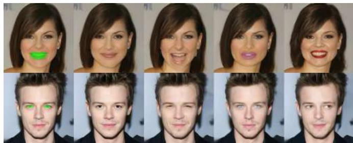

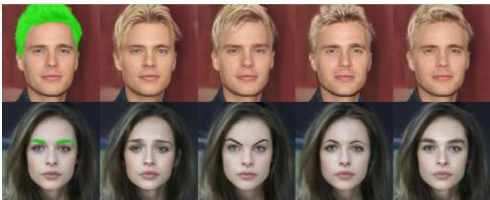  
Fig. 6: Region-specific edits. Given a mask specifying a region of interest, our method can be guided to focus on finding directions which change only the target area. The first column shows the input with the mask shown in green.

specifying a region of interest, our method can be naturally extended by applying the mask to the noise prediction $\widetilde { \epsilon } _ { t } ^ { \theta }$ in order to find directions in $h$ e-space that change a specific region the most rather than the whole image. We seek the singular vectors of the Jacobian of the masked output of the U-net. We define the a masked Jacobian $\mathbf { J } _ { t } ^ { \mathrm { m a s k e d } }$ as

$$
\mathbf {J} _ {t} ^ {\text {m a s k e d}} = \partial \widetilde {\mathbf {e}} _ {t} ^ {\theta} \left(\mathbf {x} _ {t}, \mathbf {h} _ {t}\right) / \partial \mathbf {h} _ {t}, \tag {9}
$$

$$
\widetilde {\boldsymbol {\epsilon}} _ {t} ^ {\theta} \left(\mathbf {x} _ {t}, \mathbf {h} _ {t}\right) = \boldsymbol {\epsilon} _ {t} ^ {\theta} \left(\mathbf {x} _ {t}, \mathbf {h} _ {t}\right) \odot \mathbf {M}, \tag {10}
$$

where $\odot$ denoted the Hadamard product and M is a binary mask corresponding to a region of interest. We show examples of such region-specific edits in Fig. 6.

# V. SUPERVISED DISCOVERY OF SEMANTIC DIRECTIONS

While the methods we presented in Sec. IV discover interpretable semantic directions in a fully unsupervised fashion, their effects must be interpreted manually. In this section, we demonstrate a simple supervised approach to obtain latent directions corresponding to well-defined labels.

a) Linear semantic directions from examples: The vector arithmetic property of $h$ -space suggests an intuitive method for discovering semantically meaningful directions, by providing positive and negative examples of a desired attribute. Let $\{ ( \mathbf { x } _ { i } ^ { - } , \mathbf { x } _ { i } ^ { + } ) \} _ { i = 1 } ^ { n }$ be a collection of generated images, such that all $\mathbf { x } _ { i } ^ { + }$ have a desired attribute that is absent in $\mathbf { x } _ { i } ^ { - }$ , e.g. a smile, old age, glasses, etc. Let $\mathbf { q } _ { i } ^ { - }$ and ${ \bf q } _ { i } ^ { + }$ denote the latent representation corresponding to the images $\mathbf { x } _ { i } ^ { - }$ and $\mathbf { x } _ { i } ^ { + }$ . Then, we can find a semantic direction v as

$$
\mathbf {v} = \frac {1}{n} \sum_ {i = 1} ^ {n} \left(\mathbf {q} _ {i} ^ {+} - \mathbf {q} _ {i} ^ {-}\right). \tag {11}
$$

Note that this method can be applied using either $\mathbf { h } _ { T : 1 }$ or $\mathbf { x } _ { T }$ as the latent variable. However, defining semantic directions using $\mathbf { h } _ { T : 1 }$ as the latent variable requires far fewer samples than using $\mathbf { x } _ { T }$ . Figure 8a illustrates this for DDIM $( \eta _ { t } = 0 )$ ) for a direction corresponding to smile where (11) is calculated using a varying number of samples.

b) Classifier annotation: We now propose to find linear semantic directions by using pretrained attribute classifiers to annotate samples generated by the model. Using the attribute classifier from [15], we annotate samples with probabilities corresponding to the 40 classes from CelebA [16], and use Hopenet [31] to predict pose (yaw, pitch, and roll). We sort

the annotated samples according to the attribute scores and select the samples with the highest and lowest scores from each class as the positive and negative examples respectively. We then calculate semantic directions corresponding to the different attributes using the method given in (11).

As shown in Fig. 7, we can successfully find semantic directions controlling a wide selection of meaningful attributes like yaw, smile, gender, glasses, and age. Furthermore, directions calculated by (11) can be applied in combination with one another. For example, adding $\Delta \mathbf { h } _ { T : 1 }$ for two attributes, like pose and smile, results in an image where both attributes are changed. Fig. 8b illustrates sequential editing, showcasing changes in expression followed by pose, age, and eyeglasses for two samples. In SM Sec. F we show that this method can be applied to find directions corresponding to facial expressions using DDIM inversion and a real facial expression dataset [47] as supervision.

c) Disentanglement of semantic directions: Latent directions found by (11) might be semantically entangled, in the sense that editing in the direction corresponding to some desired attribute might also induce a change in some other undesired attributes. For example, a direction for eyeglasses may also affect the age if it correlates with eyeglasses in the training data. To remedy this, we propose conditional manipulation in $h$ -space in a way similar to what was suggested in the context of GANs by Shen et al. [35], [36]. Let $\mathbf { v } _ { 1 }$ and $\mathbf { v } _ { 2 }$ be two linear semantic directions, where the two corresponding semantic attributes are entangled. We can define a new direction $\mathbf { v } _ { 1 \perp 2 }$ which only affects the semantics associated with $\mathbf { v } _ { 1 }$ , without changing the semantics associated with $\mathbf { v } _ { 2 }$ . This is done simply by removing from $\mathbf { v } _ { 1 }$ the projection of $\mathbf { v } _ { 1 }$ onto $\mathbf { v } _ { 2 }$ , namely $\mathbf { v } _ { 1 \perp 2 } = \mathbf { v } _ { 1 } - \langle \mathbf { v } _ { 1 } , \mathbf { v } _ { 2 } \rangle / \| \mathbf { v } _ { 2 } \| ^ { 2 } \mathbf { v } _ { 2 }$ . In case of conditioning on multiple semantics simultaneously, our aim is to remove the effects of a collection of $k$ directions $\{ { \mathbf { v } } _ { i } \} _ { i = 1 } ^ { k }$ from a primal direction $\mathbf { v } _ { 0 }$ in order to define a new direction v which only affects the target attribute. This can be done by constructing the matrix $\mathbf { V } = \left[ \mathbf { v } _ { 1 } , \mathbf { v } _ { 2 } , \cdots , \mathbf { v } _ { k } \right]$ and projecting $\mathbf { v } _ { 0 }$ onto the orthogonal complement of the column space of $\mathbf { V }$ by

$$
\mathbf {v} = \left[ \mathbf {I} - \mathbf {V} \left(\mathbf {V} ^ {\mathrm {T}} \mathbf {V}\right) ^ {- 1} \mathbf {V} ^ {\mathrm {T}} \right] \mathbf {v} _ {0}. \tag {12}
$$

The resulting direction will be disentangled from each of the directions $\left\{ \mathbf { v } _ { i } \right\}$ , meaning that moving a sample along this new direction will result in a large change in the attribute

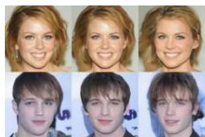  
(a) Yaw

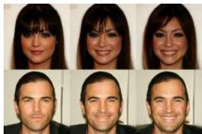  
(b) Smile

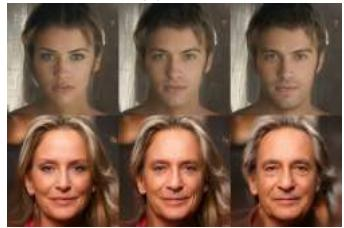  
(c) Gender

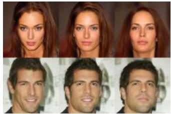  
(d) Pitch

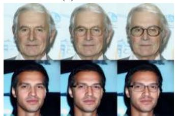  
(e) Glasses

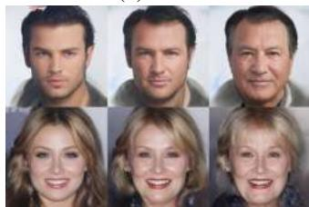  
(f) Age   
Fig. 7: Single attribute manipulation. Using a domainspecific binary attribute classifier, we find linear directions in $h$ -space corresponding to a variety of semantic edits.

associated with $\mathbf { v } _ { 0 }$ while minimally affecting the attributes associated with the other directions. Figure. 9 visualizes the effect of interpolating in the directions of age and eyeglasses for two samples. As can be seen, these directions are entangled with gender and age, respectively. By using our method we can successfully remove the entanglement and define a direction which only affects age or the presence of glasses.

To validate the effectiveness of our disentanglement strategy, we performed an experiment where we edited attributes corresponding to smile, glasses, age, gender, and wearing a hat. We edited samples using both the original and the disentangled directions while measuring the effect of each edit using CLIP [23] as a zero-shot classifier. We selected appropriate positive and negative prompts for each attribute. For smiling, glasses, and hat we used "A smiling person", "A person wearing glasses" and "A person wearing a hat" for the positive prompts respectively, and "A person" as the negative prompt. For age and gender, we used "A man" / "A woman" and "An old person" / "A young person" respectively. For each sample, we edited each of the five attributes and measured the change in attribute score according to CLIP. Table I shows the results. We can see that the original directions are highly entangled with other attributes while the disentangled directions induce the largest changes in the intended attributes. This demonstrates that semantic direc-

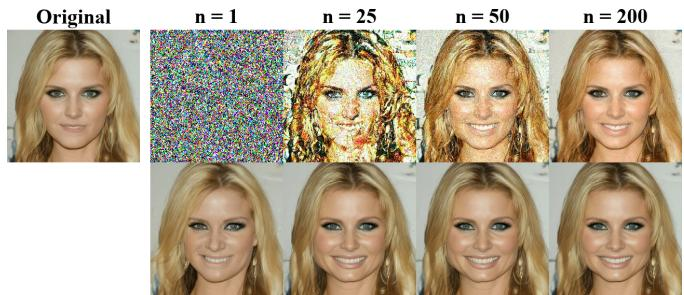

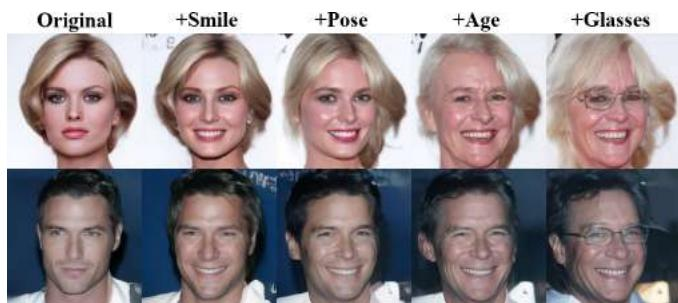  
(a) Editing in $h$ -space vs. using $\mathbf { x } _ { T }$ .   
(b) Sequential manipulation.   
Fig. 8: Editing properties of $h$ -space. (a) A qualitative comparison of the editing effect using $\mathbf { x } _ { T }$ (top) and $\mathbf { h } _ { T : 1 }$ (bottom). Latent variables using a smiling direction found by (11). While the direction in $h$ -space converges with a few labeled examples, more than 200 are required to achieve a similar result using $\mathbf { x } _ { T }$ as the latent variable. (b) Directions found with our method can be combined with one another. Here, we sequentially accumulate four effects, starting from a single effect in the 2nd column up to four effects in the 5th column.

tions can be disentangled by a simple linear projection.

# VI. DISCUSSION AND CONCLUSION

We presented several supervised and unsupervised methods for finding interpretable directions in the recently proposed semantic latent space of Denoising Diffusion Models. We showed that the principal components in latent space correspond to global and semantically meaningful editing directions like pose, gender, and age. Additionally, we proposed a novel method for discovering directions based on a single input image. These directions correspond to highly localized changes in generated images, such as raising the eyebrows or opening/closing the mouth and eyes. Although these directions were found with respect to a specific image they can be transferred to different samples.

As our proposed methods enable high-quality editing of face images, we provide a broader impact statement in SM Sec. G. Although our unsupervised approaches are effective in discovering meaningful semantics when the DDM was trained on aligned data like human faces, we found that models trained on less structured data have less interpretable principal directions. We refer the reader to SM Sec. H for experiments on models trained on churches and bedrooms.

Further, we proposed a conceptually simple supervised

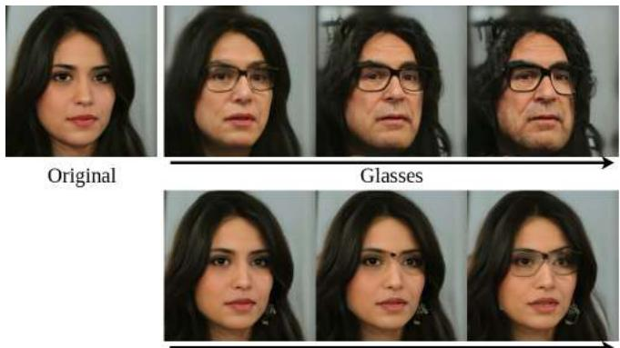  
Glasses disentangled fromageand gender

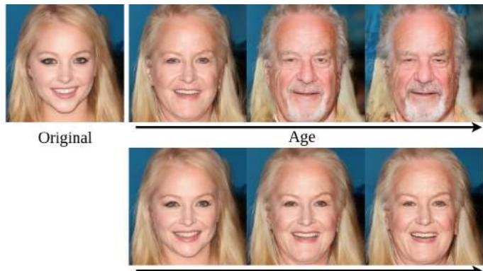  
Agedisentangled from gender   
Fig. 9: Disentanglement of semantic directions. Given a direction that is entangled with other attributes, we can create a disentangled direction by removing the projection onto undesired semantics. The top row shows the original direction, whereas the bottom row shows the disentangled direction.

TABLE I: Evaluation of disentanglement strategy. We quantitatively evaluate the effect of disentangling semantic directions using linear projection. The rows correspond to the applied directions, while the columns correspond to the effect of the edits according to CLIP. We draw and edit 100 random samples and repeat the experiment 10 times with different seeds and report the mean and standard deviations. The strongest effect in each row is highlighted.   

<table><tr><td>Effect Edit</td><td>Smile</td><td>Glasses</td><td>Age</td><td>Gender</td><td>Hat</td><td>Smile</td><td>Glasses</td><td>Age</td><td>Gender</td><td>Hat</td></tr><tr><td></td><td colspan="5">Original directions</td><td colspan="5">Disentangled directions</td></tr><tr><td>Smile</td><td>0.26±0.02</td><td>0.29±0.02</td><td>0.08±0.02</td><td>0.31±0.04</td><td>0.07±0.01</td><td>0.24±0.02</td><td>0.20±0.02</td><td>0.04±0.02</td><td>0.09±0.03</td><td>0.03±0.01</td></tr><tr><td>Glasses</td><td>0.48±0.02</td><td>0.32±0.02</td><td>0.68±0.03</td><td>0.66±0.04</td><td>0.14±0.02</td><td>0.22±0.01</td><td>0.38±0.02</td><td>0.13±0.02</td><td>0.07±0.03</td><td>0.36±0.02</td></tr><tr><td>Age</td><td>0.07±0.01</td><td>0.40±0.03</td><td>0.74±0.03</td><td>0.66±0.04</td><td>0.18±0.01</td><td>0.02±0.02</td><td>0.38±0.03</td><td>0.59±0.04</td><td>0.16±0.03</td><td>0.04±0.02</td></tr><tr><td>Gender</td><td>0.40±0.02</td><td>0.28±0.03</td><td>0.58±0.03</td><td>0.66±0.04</td><td>0.09±0.02</td><td>0.20±0.02</td><td>0.01±0.01</td><td>0.08±0.02</td><td>0.39±0.03</td><td>0.07±0.02</td></tr><tr><td>Hat</td><td>0.42±0.02</td><td>0.39±0.02</td><td>0.37±0.03</td><td>0.66±0.04</td><td>0.41±0.02</td><td>0.13±0.01</td><td>0.03±0.03</td><td>0.02±0.03</td><td>0.02±0.09</td><td>0.44±0.02</td></tr></table>

method utilizing the linear properties of the semantic latent space. We showed that a diverse set of face semantics can be revealed using an attribute classifier to annotate samples. Finally, we demonstrated that simple linear projection is an effective strategy for disentangling otherwise correlated semantic directions. All of our proposed methods apply to pretrained DDMs without requiring any adaptation to the model architecture, fine-tuning, optimization, or textbased guidance. Possible future avenues of our work include applications of the proposed approaches on different data domains.

# REFERENCES

[1] Y. Alaluf, O. Patashnik, Z. Wu, A. Zamir, E. Shechtman, D. Lischinski, and D. Cohen-Or. Third time’s the charm? image and video editing with stylegan3. In Computer Vision–ECCV 2022 Workshops: Tel Aviv, Israel, October 23–27, 2022, Proceedings, Part II, pages 204–220. Springer, 2023.   
[2] G. Couairon, J. Verbeek, H. Schwenk, and M. Cord. Diffedit: Diffusion-based semantic image editing with mask guidance. arXiv preprint arXiv:2210.11427, 2022.   
[3] P. Dhariwal and A. Nichol. Diffusion models beat gans on image synthesis. In M. Ranzato, A. Beygelzimer, Y. Dauphin, P. Liang, and J. W. Vaughan, editors, Advances in Neural Information Processing Systems, volume 34, pages 8780–8794. Curran Associates, Inc., 2021.   
[4] R. Gal, Y. Alaluf, Y. Atzmon, O. Patashnik, A. H. Bermano, G. Chechik, and D. Cohen-Or. An image is worth one word: Personalizing text-to-image generation using textual inversion, 2022.   
[5] I. Goodfellow, J. Pouget-Abadie, M. Mirza, B. Xu, D. Warde-Farley, S. Ozair, A. Courville, and Y. Bengio. Generative adversarial nets. In Z. Ghahramani, M. Welling, C. Cortes, N. Lawrence, and K. Q. Wein-

berger, editors, Advances in Neural Information Processing Systems, volume 27, page 2672–2680. Curran Associates, Inc., 2014.   
[6] R. Haas, S. Graßhof, and S. S. Brandt. Tensor-based emotion editing in the stylegan latent space. arXiv:2205.06102 [cs], May 2022. Accepted for poster presentation at AI4CC $@$ CVPRW.   
[7] E. Hark¨ onen, A. Hertzmann, J. Lehtinen, and S. Paris. Ganspace: Dis-¨ covering interpretable gan controls. Advances in Neural Information Processing Systems, 33:9841–9850, 2020.   
[8] A. Hertz, R. Mokady, J. Tenenbaum, K. Aberman, Y. Pritch, and D. Cohen-Or. Prompt-to-prompt image editing with cross attention control. arXiv preprint arXiv:2208.01626, 2022.   
[9] J. Ho, A. Jain, and P. Abbeel. Denoising diffusion probabilistic models. In H. Larochelle, M. Ranzato, R. Hadsell, M. Balcan, and H. Lin, editors, Advances in Neural Information Processing Systems, volume 33, pages 6840–6851. Curran Associates, Inc., 2020.   
[10] J. Ho and T. Salimans. Classifier-free diffusion guidance. In NeurIPS 2021 Workshop on Deep Generative Models and Downstream Applications, 2021.   
[11] B. Kawar, S. Zada, O. Lang, O. Tov, H. Chang, T. Dekel, I. Mosseri, and M. Irani. Imagic: Text-based real image editing with diffusion models. In Conference on Computer Vision and Pattern Recognition 2023, 2023.   
[12] G. Kim, T. Kwon, and J. C. Ye. Diffusionclip: Text-guided diffusion models for robust image manipulation. In Proceedings of the IEEE/CVF Conference on Computer Vision and Pattern Recognition (CVPR), pages 2426–2435, June 2022.   
[13] G. Kwon and J. C. Ye. Diffusion-based image translation using disentangled style and content representation. ICLR 2023, 2023.   
[14] M. Kwon, J. Jeong, and Y. Uh. Diffusion models already have a semantic latent space. In International Conference on Learning Representations, 2023.   
[15] J. Lin, R. Zhang, F. Ganz, S. Han, and J.-Y. Zhu. Anycost gans for interactive image synthesis and editing. In IEEE Conference on Computer Vision and Pattern Recognition (CVPR), 2021.   
[16] Z. Liu, P. Luo, X. Wang, and X. Tang. Deep learning face attributes in the wild. In Proceedings of International Conference on Computer

Vision (ICCV), December 2015.   
[17] C. Meng, Y. He, Y. Song, J. Song, J. Wu, J.-Y. Zhu, and S. Ermon. SDEdit: Guided image synthesis and editing with stochastic differential equations. In International Conference on Learning Representations, 2022.   
[18] R. Mokady, A. Hertz, K. Aberman, Y. Pritch, and D. Cohen-Or. Nulltext inversion for editing real images using guided diffusion models. arXiv preprint arXiv:2211.09794, 2022.   
[19] A. Q. Nichol, P. Dhariwal, A. Ramesh, P. Shyam, P. Mishkin, B. Mcgrew, I. Sutskever, and M. Chen. Glide: Towards photorealistic image generation and editing with text-guided diffusion models. In International Conference on Machine Learning, pages 16784–16804. PMLR, 2022.   
[20] Y.-H. Park, M. Kwon, J. Jo, and Y. Uh. Unsupervised discovery of semantic latent directions in diffusion models. arXiv preprint arXiv:2302.12469, 2023.   
[21] O. Patashnik, Z. Wu, E. Shechtman, D. Cohen-Or, and D. Lischinski. Styleclip: Text-driven manipulation of stylegan imagery. In Proceedings of the IEEE/CVF International Conference on Computer Vision (ICCV), pages 2085–2094, October 2021.   
[22] K. Preechakul, N. Chatthee, S. Wizadwongsa, and S. Suwajanakorn. Diffusion autoencoders: Toward a meaningful and decodable representation. In 2022 IEEE/CVF Conference on Computer Vision and Pattern Recognition (CVPR), page 10609–10619, New Orleans, LA, USA, Jun 2022. IEEE.   
[23] A. Radford, J. W. Kim, C. Hallacy, A. Ramesh, G. Goh, S. Agarwal, G. Sastry, A. Askell, P. Mishkin, J. Clark, and et al. Learning transferable visual models from natural language supervision. In Proc. ICML, Feb 2021. arXiv: 2103.00020.   
[24] A. Radford, L. Metz, and S. Chintala. Unsupervised representation learning with deep convolutional generative adversarial networks. In Y. Bengio and Y. LeCun, editors, 4th International Conference on Learning Representations, ICLR 2016, San Juan, Puerto Rico, May 2-4, 2016, Conference Track Proceedings, 2016.   
[25] Y. Q. Rameen Abdal and P. Wonka. Image2StyleGAN++: How to edit the embedded images? In Proc. CVPR, pages 8293–8302, Aug 2020.   
[26] A. Ramesh, P. Dhariwal, A. Nichol, C. Chu, and M. Chen. Hierarchical text-conditional image generation with CLIP latents. CoRR, abs/2204.06125, 2022.   
[27] A. Ramesh, M. Pavlov, G. Goh, S. Gray, C. Voss, A. Radford, M. Chen, and I. Sutskever. Zero-shot text-to-image generation, 2021.   
[28] R. Rombach, A. Blattmann, D. Lorenz, P. Esser, and B. Ommer. Highresolution image synthesis with latent diffusion models, 2021.   
[29] O. Ronneberger, P. Fischer, and T. Brox. U-net: Convolutional networks for biomedical image segmentation. In N. Navab, J. Hornegger, W. M. Wells, and A. F. Frangi, editors, Medical Image Computing and Computer-Assisted Intervention – MICCAI 2015, pages 234–241, Cham, 2015. Springer International Publishing.   
[30] D. A. Ross, J. Lim, R.-S. Lin, and M.-H. Yang. Incremental learning for robust visual tracking. International journal of computer vision, 77:125–141, 2008.   
[31] N. Ruiz, E. Chong, and J. M. Rehg. Fine-grained head pose estimation without keypoints. In The IEEE Conference on Computer Vision and Pattern Recognition (CVPR) Workshops, June 2018.   
[32] N. Ruiz, Y. Li, V. Jampani, Y. Pritch, M. Rubinstein, and K. Aberman. Dreambooth: Fine tuning text-to-image diffusion models for subjectdriven generation. arXiv preprint arXiv:2208.12242, 2022.   
[33] Y. Saad. Numerical methods for large eigenvalue problems: revised edition. SIAM, 2011.   
[34] C. Saharia, W. Chan, S. Saxena, L. Li, J. Whang, E. Denton, S. K. S. Ghasemipour, R. Gontijo-Lopes, B. K. Ayan, T. Salimans, J. Ho, D. J. Fleet, and M. Norouzi. Photorealistic text-to-image diffusion models with deep language understanding. In A. H. Oh, A. Agarwal, D. Belgrave, and K. Cho, editors, Advances in Neural Information Processing Systems, 2022.   
[35] Y. Shen, J. Gu, X. Tang, and B. Zhou. Interpreting the latent space of gans for semantic face editing. In Conference on Computer Vision and Pattern Recognition (CVPR), 2020.   
[36] Y. Shen, C. Yang, X. Tang, and B. Zhou. Interfacegan: Interpreting the disentangled face representation learned by gans. TPAMI, 2020.   
[37] Y. Shen and B. Zhou. Closed-form factorization of latent semantics in gans. In Conference on Computer Vision and Pattern Recognition (CVPR), 2021.   
[38] J. Sohl-Dickstein, E. Weiss, N. Maheswaranathan, and S. Ganguli. Deep unsupervised learning using nonequilibrium thermodynamics. In F. Bach and D. Blei, editors, Proceedings of the 32nd International Conference on Machine Learning, volume 37 of Proceedings of Machine Learning Research, pages 2256–2265, Lille, France, 07–09

Jul 2015. PMLR.   
[39] J. Song, C. Meng, and S. Ermon. Denoising diffusion implicit models. arXiv:2010.02502, October 2020.   
[40] N. Spingarn, R. Banner, and T. Michaeli. GAN Steerability without optimization. In International Conference on Learning Representations, 2021.   
[41] A. Tewari, M. Elgharib, G. Bharaj, F. Bernard, H.-P. Seidel, P. Perez, ´ M. Zollhofer, and C. Theobalt. StyleRig: Rigging StyleGAN for 3d ¨ control over portrait images. In Proc. CVPR). IEEE, June 2020.   
[42] N. Tumanyan, M. Geyer, S. Bagon, and T. Dekel. Plug-and-play diffusion features for text-driven image-to-image translation. In IEEE Conference on Computer Vision and Pattern Recognition (CVPR), pages 1921–1930, 2023.   
[43] D. Valevski, M. Kalman, Y. Matias, and Y. Leviathan. Unitune: Textdriven image editing by fine tuning an image generation model on a single image, 2022.   
[44] P. von Platen, S. Patil, A. Lozhkov, P. Cuenca, N. Lambert, K. Rasul, M. Davaadorj, and T. Wolf. Diffusers: State-of-the-art diffusion models. https://github.com/huggingface/diffusers, 2022.   
[45] X. Wang, H. Guo, S. Hu, M.-C. Chang, and S. Lyu. Gangenerated faces detection: A survey and new perspectives. ArXiv, abs/2202.07145, 2022.   
[46] Z. Wu, D. Lischinski, and E. Shechtman. Stylespace analysis: Disentangled controls for StyleGAN image generation. In Proc. CVPR, Dec 2020.   
[47] L. Yin, X. Wei, Y. Sun, J. Wang, and M. Rosato. A 3d facial expression database for facial behavior research. In 7th Intern. Conf. on Automatic Face and Gesture Recognition (FGR06), pages 211–216, 2006.   
[48] J. Zhu, R. Feng, Y. Shen, D. Zhao, Z. Zha, J. Zhou, and Q. Chen. Low-rank subspaces in GANs. In Advances in Neural Information Processing Systems (NeurIPS), 2021.

# APPENDIX

# Supplemental Materials

# A. Illustration of $h$ -space.

In this paper, we define $h$ -space as the space of bottleneck activations $\mathbf { h } _ { t }$ across each of the $T$ timesteps in the synthesis process. See illustration in Fig. 10. Each downsampling block increases the number of channels while decreasing the spacial dimension of the feature maps. In our case, using the pretrained DDPM model trained on CelebA released by Google2. The input pixel space has dimensions (3, 256, 256) and the deepest feature map has dimensions (512, 8, 8). Thus an element of $h$ -space, $\mathbf { h } _ { T : 1 }$ , has dimensions $( T , 5 1 2 , 8 , 8 )$ and is defined as

$$
\mathbf {h} _ {T: 1} = \mathbf {h} _ {T} \otimes \mathbf {h} _ {T - 1} \otimes \dots \otimes \mathbf {h} _ {2} \otimes \mathbf {h} _ {1}. \tag {13}
$$

We apply directions in $h$ space by perturbing $\mathbf { h } _ { T : 1 }$ with some offset as ${ \bf h } _ { T : 1 } + \Delta { \bf h } _ { T : 1 }$ during the generative process in (2). When $\eta _ { t } \neq 0$ the clean image is completely specified by the triple $\left( \mathbf { x } _ { T } , \mathbf { z } _ { T : 1 } , \Delta \mathbf { h } _ { T : 1 } \right)$ and for $\eta _ { t } = 0$ (DDIM) it is determined by the tuple $( \mathbf { x } _ { T } , \Delta \mathbf { h } _ { T : 1 } )$ .

# B. The effect of Asyrp

In the main text, we stated that using Asyrp [14] acts to amplify the effect edits in $h$ -space. However, Asyrp is computationally costly since it requires two forward passes of the U-Net at each denoising step. Hence, Asyrp is not used for any of the results shown in the main paper. In Figs. 11 and 12 we qualitatively compare edits with and without using Asyrp. We observe that simply adjusting the scale of the applied direction results in very similar edits.

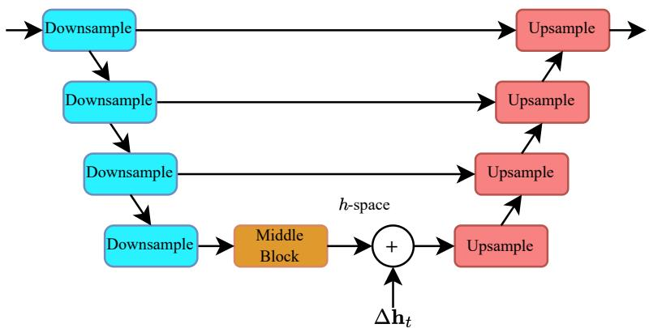  
Fig. 10: Illustration of $h$ -space. In this paper, we define the semantic latent space of DDMs as the activation after the deepest bottleneck layer of the U-Net.

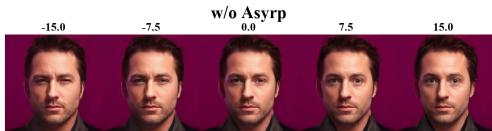  
w/Asyrp-same scale

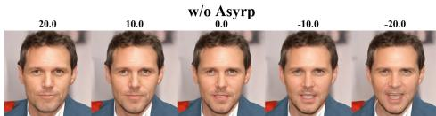  
w/Asyrp-same scale

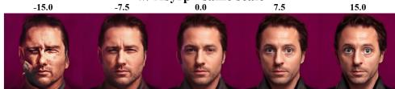  
w/Asyrp-lower scale

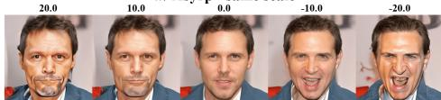  
w/Asyrp-lower scale

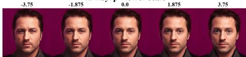  
(a) Eyes

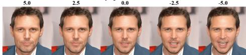  
(b) Mouth   
Fig. 11: The Effect of Asyrp. Results are shown for directions found with Alg. 1.

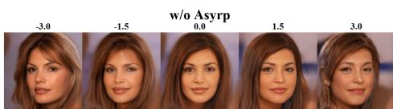  
w/Asyrp-same scale

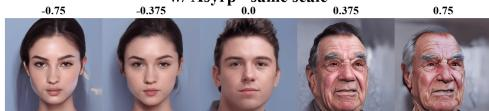  
w/Asyrp-lower scale

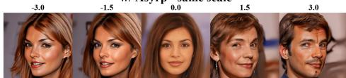  
w/Asyrp-lower scale

  
(a) Age

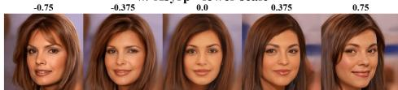  
(b) Rotation

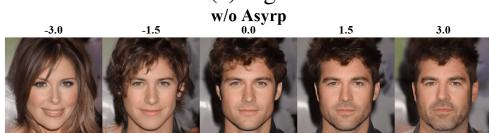  
w/Asyrp-same scale

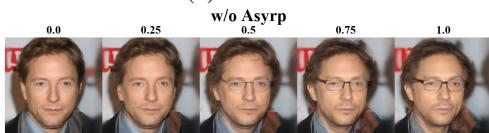  
w/Asyrp- same scale

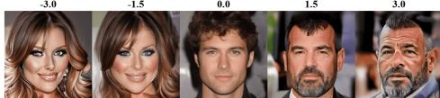  
w/Asyrp-lowerscale

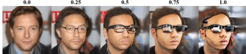  
w/Asyrp-lower scale

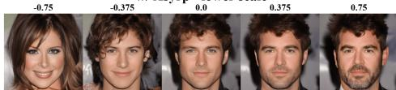  
(c) Gender

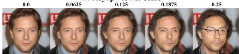  
(d) Glasses   
Fig. 12: The effect of Asyrp. Results are shown for directions found using the supervised method presented in Sec. V.

# C. A Note on image-specific directions

In the main paper, we state that the right singular vectors of the Jacobian of $\epsilon _ { t } ^ { \theta }$ with respect to $h$ -space, denoted as $\mathbf { J } _ { t }$ , are the set of orthogonal vectors in $h$ -space which perturb the noise prediction $\epsilon _ { t } ^ { \theta }$ the most. An equivalent statement is that those right singular vectors perturb the predicted image $\mathbf { P } _ { t } ( \mathbf { x } _ { t } , \mathbf { h } _ { t } )$ at timestep $t$ the most. Specifically, since

$$
\mathbf {P} _ {t} \left(\mathbf {x} _ {t}, \mathbf {h} _ {t}\right) = \frac {\mathbf {x} _ {t} - \sqrt {1 - \alpha_ {t}}}{\sqrt {\alpha_ {t}}} \boldsymbol {\epsilon} _ {t} ^ {\theta} \left(\mathbf {x} _ {t}, \mathbf {h} _ {t}\right) \tag {14}
$$

we have that

$$
\frac {\partial}{\partial \mathbf {h} _ {t}} \mathbf {P} _ {t} \left(\mathbf {x} _ {t}, \mathbf {h} _ {t}\right) = - \frac {\sqrt {1 - \alpha_ {t}}}{\sqrt {\alpha_ {t}}} \frac {\partial}{\partial \mathbf {h} _ {t}} \tag {15}
$$

$$
\boldsymbol {\epsilon} _ {t} ^ {\theta} \left(\mathbf {x} _ {t}, \mathbf {h} _ {t}\right) = - \frac {\sqrt {1 - \alpha_ {t}}}{\sqrt {\alpha_ {t}}} \mathbf {J} _ {t}. \tag {16}
$$

Thus, the eigenvectors of $( \partial \mathbf { P } _ { t } / \partial \mathbf { h } _ { t } ) ^ { \mathrm { T } } ( \partial \mathbf { P } _ { t } / \partial \mathbf { h } _ { t } )$ and $\mathbf { J } _ { t } ^ { \mathrm { T } } \mathbf { J } _ { t }$ are the same with the same ordering.

# D. Image-specific directions at different timesteps

Our proposed image-specific unsupervised method in Alg. 1 finds different directions for each timestep. In Figures 13, 14, 15 and 16 we show the effect of the three dominant directions (the three top singular vectors of the Jacobian) at different timesteps along the reverse diffusion process.

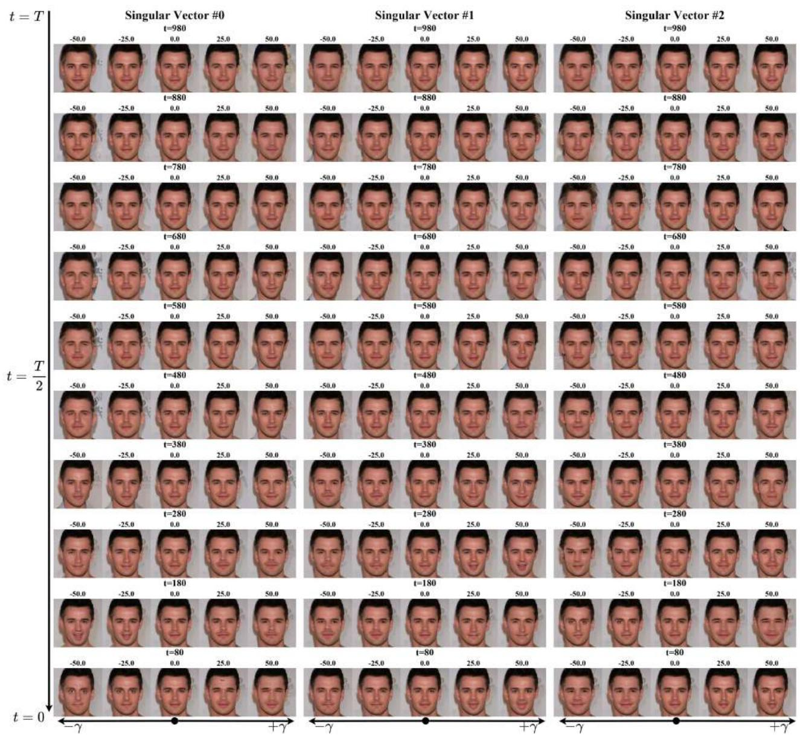  
Fig. 13: Directions found by Alg. 1.

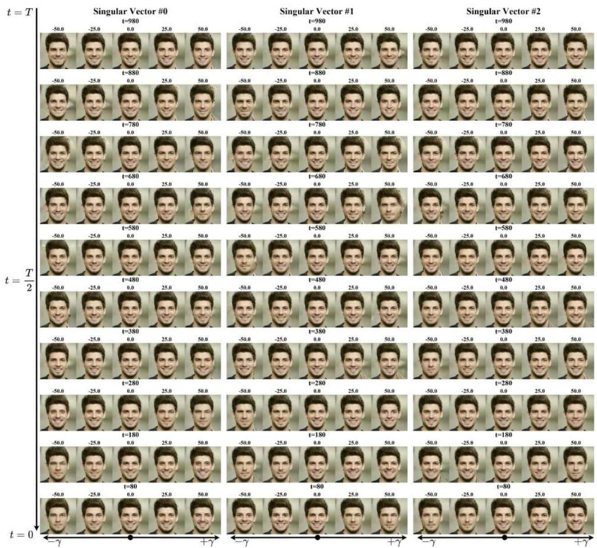  
Fig. 14: Directions found by Alg. 1.

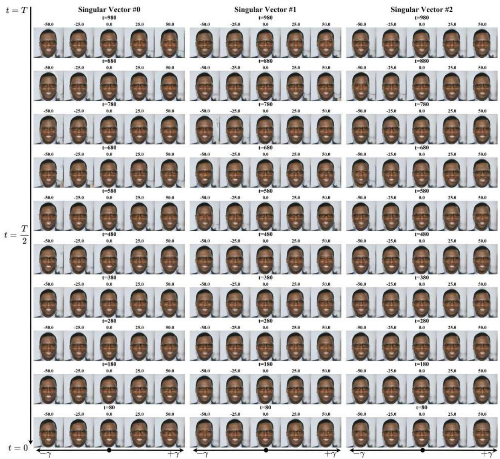  
Fig. 15: Directions found by Alg. 1.

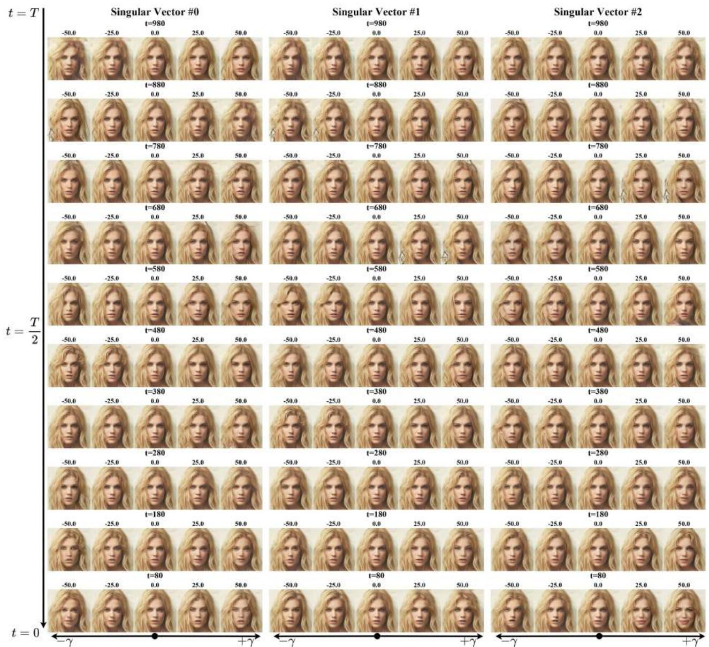  
Fig. 16: Directions found by Alg. 1.

# E. Sequential algorithm for Jacobian subspace iteration

As mentioned in the main text, Alg. 1 can be memory intensive when calculating a large number of singular vectors in parallel. In cases where limited memory is available, we provide an alternative sequential version of our method in Alg. 2. Here we calculate the singular values and vectors in mini-batches of size b. The value of $b$ should be set according to the parallel computation capacity. For example, in the special case of $b = 1$ , the algorithm computes the vectors one by one and will use small memory. Note that lowering the mini-batch size $b$ comes at the expense of longer running time.

Algorithm 2 Sequential Jacobian subspace iteration   
Input: function to differentiate $\mathbf{f}:\mathbb{R}^{d_{\mathrm{in}}}\rightarrow \mathbb{R}^{d_{\mathrm{out}}}$ , point at which to differentiate $\mathbf{h}\in \mathbb{R}^{d_{\mathrm{in}}}$ , initial guess $\Theta \in \mathbb{R}^{d_{\mathrm{in}}\times k}$ [optional], mini-batch size $b <   k$ Output: $(\mathbf{U},\Sigma ,\mathbf{V}^{\mathrm{T}}) - k$ top singular values and vectors of the Jacobian $\partial \mathbf{f} / \partial \mathbf{h}$ Initialization: $\mathbf{y}\gets \mathbf{f}(\mathbf{h})$ $i_{\mathrm{start}}\gets 1$ $i_{\mathrm{end}}\gets b$ $\mathbf{V}\gets []$ $\Sigma \gets []$ $\mathbf{U}\gets []$ while $i_{\mathrm{start}}\leq k$ do if $\Theta$ is empty then $\Phi \gets$ i.i.d. standard Gaussian samples in $\mathbb{R}^{d_{\mathrm{in}}\times (i_{\mathrm{end}} - i_{\mathrm{start}} + 1)}$ else $\Phi \gets$ columns $i_{\mathrm{start}}$ to $i_{\mathrm{end}}$ of $\Theta$ end if $\mathbf{Q},\mathbf{R}\gets \mathbf{QR}(\mathbf{\Phi})$ $\ntriangleright$ Reduced QR decomposition $\Phi \gets \mathbf{Q}$ $\triangleright$ Ensures $\Phi^{\mathrm{T}}\Phi = \mathbf{I}$ while stopping criterion do if $\mathbf{V}$ is not empty then $\Phi \gets \left[\mathbf{I} - \mathbf{V}\left(\mathbf{V}^{\mathrm{T}}\mathbf{V}\right)^{-1}\mathbf{V}^{\mathrm{T}}\right]\Phi$ $\Phi ,\mathbf{R}\gets \mathbf{QR}(\Phi)$ end if $\Psi \gets \partial \mathbf{f}(\mathbf{h} + a\Phi) / \partial a$ at $a = 0$ $\hat{\Phi}\gets \partial (\Psi^{\mathrm{T}}\mathbf{y}) / \partial \mathbf{h}$ $\Phi ,\mathbf{S},\mathbf{R}\gets \mathrm{SVD}(\hat{\Phi})$ end while $\mathbf{V}\gets [\mathbf{V};\Phi ]$ $\Sigma \gets \left[ \begin{array}{ll}\Sigma & 0\\ 0 & \mathbf{S}^{1 / 2} \end{array} \right]$ $\mathbf{U}\gets [\mathbf{U};\Psi ]$ $i_{\mathrm{start}}\gets i_{\mathrm{start}} + b$ $i_{\mathrm{end}}\gets \min \{i_{\mathrm{end}} + b,k\}$ end while   
Orthonormalize $\mathbf{U}$

# F. Facial expressions from real data.

We conducted an additional experiment where domain-specific semantic directions were extracted using real images as supervision. We wish to find directions corresponding to expressions like happiness, sadness, and surprise. Here we used the BU3DFE data set [47]. BU3DFE contains real images of 100 subjects, each performing a neutral expression in addition to each of the prototypical facial expressions at various intensity levels. Using DDIM inversion $( \eta _ { t } = 0 )$ ) we recorded $\mathbf { h } _ { T : 1 }$ during the inversion process and used (11) to calculate directions. We used the most intense expressions for the positive examples and the neutral expressions for the negative examples. The effect of the directions found using our method is shown in Fig. 17. The extracted directions are shown on generated samples. The figure shows that latent directions in $h$ -space can successfully be found by applying our supervised method presented in Sec. V-.0.b on a dataset of real images.

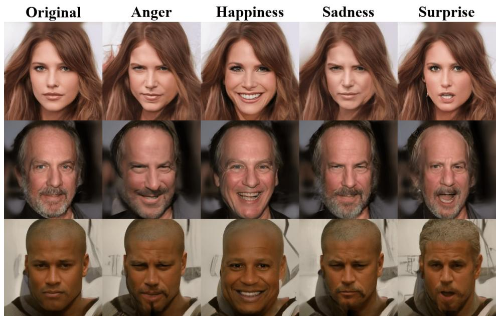  
Fig. 17: Facial expressions from real data. We extract semantic directions corresponding to different facial expressions using a data set of real images. The directions are calculated via DDIM inversion and applied in the semantic $h$ -space to synthetic images.

# G. Broader impact

In this paper, we have introduced several techniques for semantic editing of human faces using DDMs. While the creation of high-quality edited images that are difficult to distinguish from real images has significant positive applications, there is also the potential for malicious or misleading use, such as in the creation of deepfakes. Although some research has focused on detecting and mitigating the risk of AI-edited images, these have mostly focused on GANs [45] and, so far, there has been little research into detecting images that have been edited using DDMs. Given the differences in the generative process between DDMs and GANs, methods which are effective in detecting images edited by GANs might not be as effective for images edited by DDMs [17]. Further research is needed to develop effective methods for forensic analysis of edits using DDMs. Such research could help address the risk of malicious use of image-editing technologies.

# H. Unsupervised methods on other domains

In addition to the model3 trained on CelebA, which is used throughout the main paper, we also conducted experiments with models trained on churches4 and bedrooms5. Although the unsupervised directions found with both PCA and Alg. 1 on these models lead to various changes to the images, these directions are less interpretable than those obtained for faces in the main paper. We showcase the first 5 PCA directions on the models trained on churches and bedrooms in Figures 18 and 19 and directions found using Alg. 1 in Figures 21 and 20.

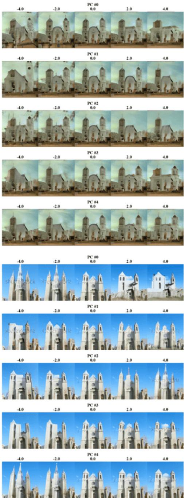

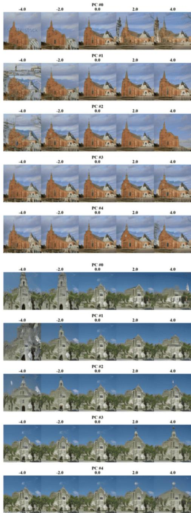  
Fig. 18: PCA directions. For a DDM trained on churches.

3https://huggingface.co/google/ddpm-ema-celebahq-256   
4https://huggingface.co/google/ddpm-ema-church-256   
5https://huggingface.co/google/ddpm-ema-bedroom-256

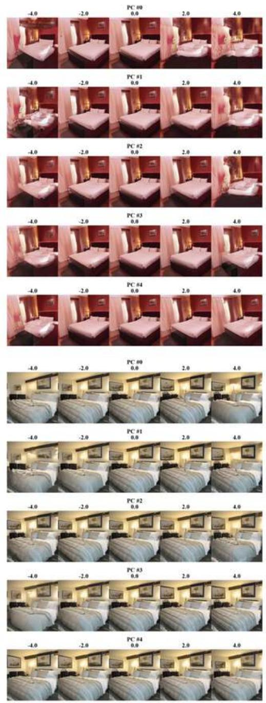

  
Fig. 19: PCA directions. For a DDM trained on bedrooms.

  
Fig. 20: Directions found with Alg. 1. For a DDM trained on bedrooms.

  
Fig. 21: Directions found with Alg. 1. For a DDM trained on churches.